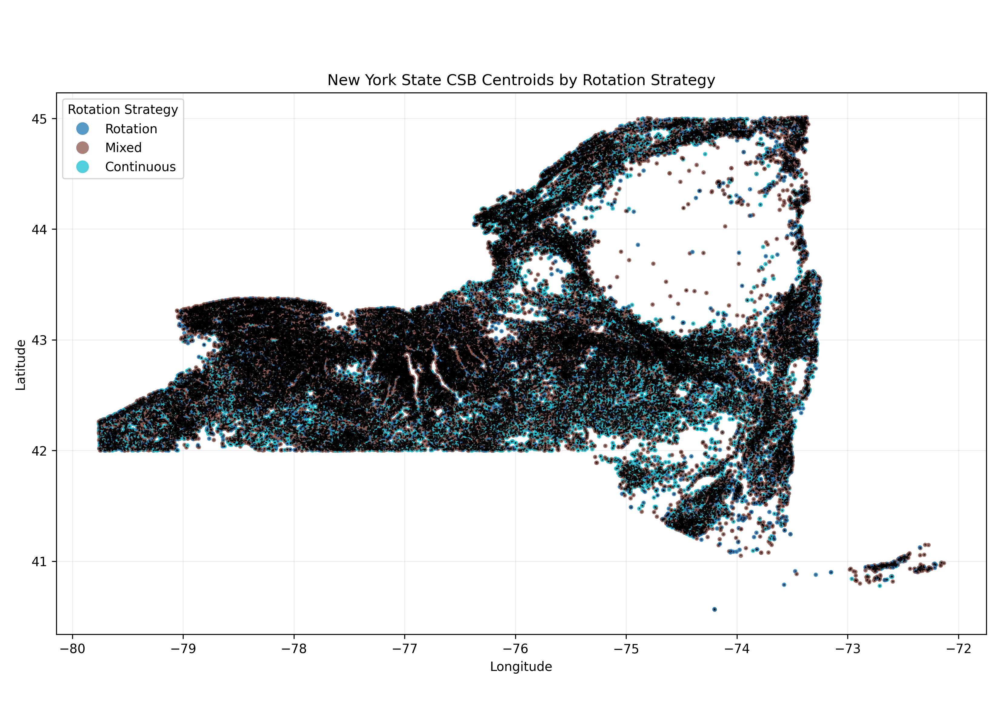
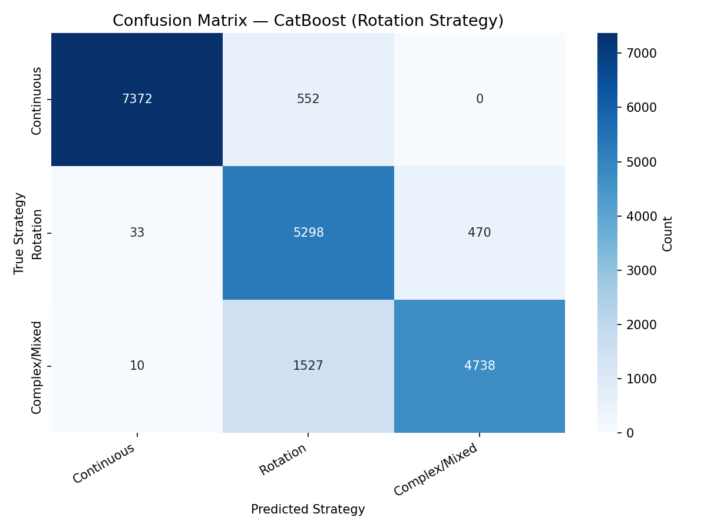
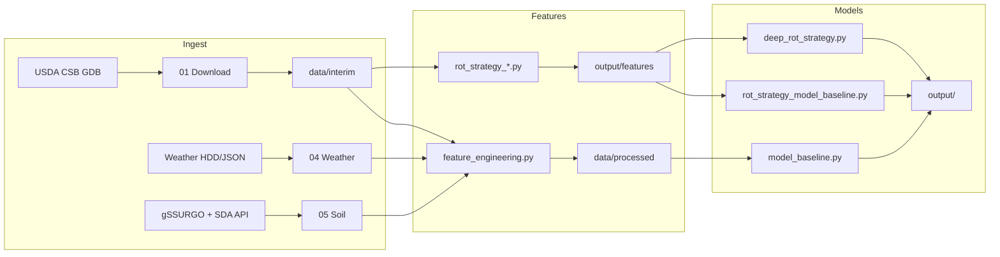

# Acreage Forecasting and Uncertainty Quantification in NY State

Cornell MPS capstone (Spring 2026): predict field-level crop planting strategy and county/state acreage from **1.55M USDA Crop Sequence Boundaries (CSB)** polygons (2008–2024), with uncertainty quantification.

<p align="center">
  
  
</p>

## Results at a Glance

| Task | Best model | Key metric |
|------|------------|------------|
| Planting strategy (3-class) | CatBoost | 87.0% accuracy, 96.9% macro ROC AUC |
| Planting strategy (3-class) | LSTM | 91.9% accuracy |
| Crop type (5-class) | CatBoost | >91% accuracy, 96% macro F1 |
| Acreage regression | Per-crop Random Forest | R² 0.82–0.98; 94.9% prediction-interval coverage |

Full methodology and uncertainty analysis: [`docs/report/MPS_Acreage_Forecasting_Report.pdf`](docs/report/MPS_Acreage_Forecasting_Report.pdf)

## Documentation

| Resource | Path |
|----------|------|
| Capstone report (PDF) | [`docs/report/MPS_Acreage_Forecasting_Report.pdf`](docs/report/MPS_Acreage_Forecasting_Report.pdf) |
| Poster (PDF) | [`docs/poster/MPS_Poster.pdf`](docs/poster/MPS_Poster.pdf) |
| Slides (PDF) | [`docs/slides/MPS_Capstone_Slides.pdf`](docs/slides/MPS_Capstone_Slides.pdf) |
| Data download & regeneration | [`data/README.md`](data/README.md) |
| Model output guide | [`output/README.md`](output/README.md) |
| Contributors | [`CONTRIBUTORS.md`](CONTRIBUTORS.md) |

## Pipeline



## Quick Start

```bash
git clone https://github.com/restinghouse0203/Acreage-Forecasting-and-Uncertainty-Quantification-in-NY-State.git
cd Acreage-Forecasting-and-Uncertainty-Quantification-in-NY-State

# Environment (pick one)
pip install -r requirements.txt
# mamba env create -f environment.yml && mamba activate acreage-capstone

git lfs install && git lfs pull   # fetch large parquet/feather files

# Download raw CSB geodatabases — see data/README.md
# Then run feature + model scripts:
python src/rot_strategy_model_baseline.py
python src/model_baseline.py
```

> **Note:** Scripts default to **50K–100K row subsamples** for runtime. Set `SAMPLE_SIZE = None` in the relevant `src/` script for full-data training.

## Repository Layout

| Path | Contents |
|------|----------|
| `notebooks/` | Numbered pipeline narrative (01–07) |
| `src/` | Importable feature engineering and model modules |
| `scripts/data_pipeline/` | County/soil merge utilities |
| `data/` | Raw, interim, processed, weather, soil (see `data/README.md`) |
| `output/` | Regenerated model plots and CSVs |
| `docs/` | Report, poster, slides, curated figures |
| `archive/` | Superseded local copies (not pushed to GitHub) |

## Data Sources

- **Crop Sequence Boundaries (CSB)** — USDA NASS, 2008–2024 field polygons with CDL rotation history ([download](https://www.nass.usda.gov/Research_and_Science/Crop-Sequence-Boundaries/))
- **Weather** — County-level HDD summaries and combined monthly features (`data/weather/`)
- **Soil** — gSSURGO map-unit attributes + CSBID→MUKEY lookup via USDA Soil Data Access API (`data/soil/`)

## Methods (summary)

- **Feature engineering** — Merge three CSB rolling windows (2008–2015, 2016 bridge, 2017–2024) with county weather lags, soil attributes, and rotation-pattern features (Lag1–5, crop diversity).
- **Classification** — KNN and CatBoost baselines for 5-class crop type and 3-class rotation strategy (Continuous / Rotation / Complex); LSTM sequence model for rotation strategy.
- **Uncertainty** — Per-crop Random Forest acreage models with prediction intervals; evaluated via coverage rates on held-out years.

## Reproducibility

- Paths are centralized in [`src/config.py`](src/config.py) — no machine-specific absolute paths.
- Raw multi-GB CSB geodatabases are **not** in git; interim subsets and processed tables use **Git LFS**.
- Default model scripts subsample for speed; full NY dataset = ~1.55M polygons × 17 years of features.
- See [`data/README.md`](data/README.md) for the complete regeneration order.

## Future Work

- End-to-end CLI wrappers (`scripts/run_crop_models.py`, `scripts/run_rotation_models.py`)
- GitHub Actions smoke tests on a stratified data sample
- Real-time county acreage dashboard with updated CSB releases
- Expand uncertainty quantification to rotation-strategy predictions (conformal / ensemble methods)

## License

Code: [MIT](LICENSE). USDA CSB and gSSURGO data remain subject to their respective agency terms — this repository links to sources and does not redistribute raw federal geodatabases.

## Team

Tony Au · Wenlin Huang · Sirui Cao · Yuheng Shen · Yiyou Jin

Advisors: Luca Sartore (USDA/NISS), David Ruppert (Cornell)
